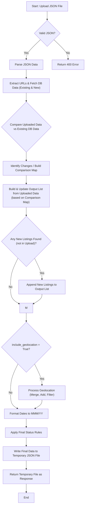

# Endpoint Documentation: `POST /data/export`

This endpoint processes an uploaded JSON file containing property listings, compares it with data stored in the database, applies merging logic and business rules, and returns an updated JSON file.

## Parameters

The endpoint accepts `multipart/form-data` with the following fields:

- `file` (Optional `UploadFile`): The JSON file containing an array of listing objects. If not provided, a 400 error is returned. Must be a `.json` file.
- `link_field` (Optional `str`, default: `"Property Link"`): The key within each JSON object in the uploaded file that holds the unique URL for the property listing. This URL is used to match listings with database records.
- `include_geolocation` (Optional `bool`, default: `False`):
  - If `True`, the endpoint will merge longitude and latitude data from the database into the matching listings in the output. It will also add any listings from the database that have geolocation data but were not present in the uploaded file. Finally, the entire output dataset will be filtered to _only_ include listings that have non-null longitude values.
  - If `False`, geolocation data is not explicitly merged or used for filtering, although existing listings fetched from the database might already contain it.
- `only_sold_listings` (Optional `bool`, default: `True`): This flag controls how the `Availability` status is handled during the comparison between the uploaded file and existing database records:
  - If `True` (Default): When comparing an uploaded listing to a database listing, if the _database_ listing's `Availability` is **not** 'Sold' (e.g., it's 'Available'), the comparison for the `Availability` field is skipped for that listing. This effectively preserves the 'Available' status from the database, preventing it from being overwritten by the uploaded file's value. However, if the database listing _is_ 'Sold', the comparison proceeds, and if the uploaded file has a different status (e.g., 'Available'), the uploaded status will overwrite the 'Sold' status in the output.
  - If `False`: The `Availability` field is always compared. If the uploaded listing's `Availability` differs from the database listing's `Availability`, the value from the _uploaded_ file will be used in the final output (because `Availability` is in the `replace_columns` list). This allows an 'Available' status in the upload to overwrite a 'Sold' or 'Delisted' status from the database.
- `file_version` (Optional `str`, default: `"_v1"`): A suffix added to the original filename before the `.json` extension for the returned file (e.g., `inputfile.json` becomes `inputfile_v1.json`). Note that the behaviors described as v1, v2, v3 in the `README.md` correspond to different combinations of the `only_sold_listings` and `include_geolocation` parameters, not directly to this suffix value itself.
- `db` (Dependency): A database session injected by FastAPI.

## Process Flow

## Key Logic Details

1.  **Data Fetching:**

    - Fetches listings from the database that match the URLs provided in the `link_field` of the uploaded JSON.
    - Fetches "new" listings from the database (identified by a `reid_id` pattern corresponding to the previous month) that are marked as available.

2.  **Comparison and Merging:**

    - Compares each uploaded listing with its corresponding database record (if found).
    - Specific fields are checked for differences (`Region`, `Years`, `Location`, `Description`, `Image`, `Source A`, `Title`, `Bedrooms`, `Bathrooms`, `Build Size (SQM)`, `Land Size (SQM)`, `Property Type`, `Contract Type`, `Availability`).
    - Updates are applied based on these rules:
      - If the uploaded field is empty but the database field has a value, the database value is used in the output.
      - If both fields have values but they differ, the uploaded value overwrites the database value _only if_ the field is in the `replace_columns` list (`Source A`, `Title`, `Image`, `Bedrooms`, `Bathrooms`, `Build Size (SQM)`, `Land Size (SQM)`, `Contract Type`, `Years`, `Availability`).
      - The `Availability` comparison is further subject to the `only_sold_listings` parameter as described above.
      - Special formatting is applied to `Build Size (SQM)`, `Land Size (SQM)`, and `Title` before comparison.

3.  **Output Construction:**

    - The initial output list is based on the uploaded data.
    - Items corresponding to database listings with identified changes are updated with the database values (`v["after"]` from comparison).
    - New listings fetched from the database (that were not present in the uploaded file) are appended.
    - If `include_geolocation` is true, geolocation data is merged, missing listings with geolocation are added, and the final list is filtered to include only those with longitude.

4.  **Final Formatting and Rules:**
    - Date fields (`Sold Date`, `List Date`, `Scrape Date`) are converted from timestamps or datetime objects to strings in the format `MMM/YY` (e.g., "Apr/25").
    - `Availability`, `Site Status`, and `Sold Date` are finalized:
      - If original `Availability` was "Delisted", output `Availability` becomes "Sold" and `Site Status` becomes "Delisted".
      - If original `Availability` was "Sold", output `Site Status` becomes `None`.
      - If `Availability` is "Sold" or "Delisted" and `Sold Date` is missing, `Sold Date` is set to the first day of the previous month (formatted as `MMM/YY`).
      - If `Availability` is neither "Sold" nor "Delisted", `Site Status` and `Sold Date` are set to `None`.

## Output

- **Success:** Returns a `FileResponse` containing the processed data in JSON format. The filename is based on the uploaded file's name with the `file_version` suffix. The HTTP status code is 200.
- **Error:** Returns a JSON response with a `detail` message and an appropriate HTTP status code (e.g., 400 for bad input, 500 for server errors).
